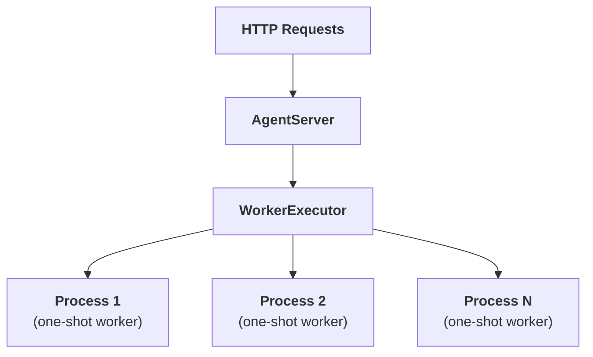
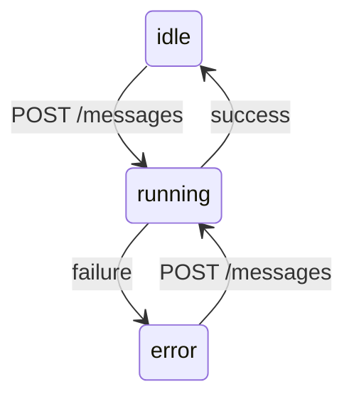

# Serving

Expose any agent as an HTTP server with session-based conversations and process-per-request isolation using `motus serve`.

## Quick Start

Any `ServableAgent` (including `AgentBase` subclasses) can be served directly:

```python
# myapp.py
from motus.agent import ReActAgent
from motus.models import AnthropicChatClient

client = AnthropicChatClient()

agent = ReActAgent(
    client=client,
    model_name="claude-opus-4-6",
    system_prompt="You are a helpful assistant.",
)
```

```bash
# Start the server
motus serve start myapp:agent --port 8000

# Chat interactively
motus serve chat http://localhost:8000
```

See [Agent Types](#agent-types) for other patterns (Google ADK, Anthropic SDK, OpenAI Agents SDK, plain functions).

---

## Contents

- [Quick Start](#quick-start)
- [Contents](#contents)
- [Agent Types](#agent-types)
  - [ServableAgent Protocol](#servableagent-protocol)
  - [Google ADK](#google-adk)
  - [Anthropic SDK](#anthropic-sdk)
  - [OpenAI Agents SDK](#openai-agents-sdk)
  - [Callable Function](#callable-function)
- [Architecture](#architecture)
  - [Session Lifecycle](#session-lifecycle)
  - [File Structure](#file-structure)
- [CLI](#cli)
  - [`start`](#start)
  - [`chat`](#chat)
  - [`health`](#health)
  - [`create`](#create)
  - [`sessions`](#sessions)
  - [`get`](#get)
  - [`delete`](#delete)
  - [`messages`](#messages)
  - [`send`](#send)
- [REST API](#rest-api)
  - [Health](#health-1)
  - [Sessions](#sessions-1)
  - [Messages](#messages-1)
  - [Webhooks](#webhooks)
- [Python API](#python-api)
  - [`AgentServer`](#agentserver)

---

## Agent Types

Every agent type follows the same turn contract: receive a `ChatMessage` and the session's prior state, return a response `ChatMessage` and updated state.

| Parameter | Type | Description |
|---|---|---|
| `message` | `ChatMessage` | The new user message (constructed by the server from the HTTP request). |
| `state` | `list[ChatMessage]` | The session's state from the previous turn (empty list on first turn). |

**Return value**: `tuple[ChatMessage, list[ChatMessage]]` — the response message (surfaced to the HTTP client) and the updated state (stored in the session). The agent owns the state and can append, compact, or restructure it freely.

All agent types run in worker subprocesses and are resolved by import path — the object must be importable from the worker (i.e., defined at module level).

### ServableAgent Protocol

Any object with a conforming `run_turn` method can be served directly. This is a runtime-checkable `Protocol`, so inheritance is not required.

```python
from motus.serve import ServableAgent  # runtime-checkable Protocol

class MyAgent(ServableAgent):
    async def run_turn(self, message: ChatMessage, state: list[ChatMessage]) -> tuple[ChatMessage, list[ChatMessage]]:
        response = ChatMessage.assistant_message(content="hello")
        return response, state + [message, response]
```

Built-in implementations include `AgentBase` (and subclasses like `ReActAgent`), as well as the framework adapters below.

### Google ADK

Google ADK agents are supported via `motus.google_adk.agents.Agent`, a subclass of the ADK `Agent` that implements `ServableAgent`. Pass it directly:

```python
from motus.google_adk.agents.llm_agent import Agent

agent = Agent(
    model="gemini-2.0-flash",
    name="my_agent",
    instruction="You are a helpful assistant.",
)
```

```bash
motus serve start myapp:agent
```

Session history is replayed automatically each turn so the model sees full conversation context. Requires the optional `google-adk` dependency.

### Anthropic SDK

Anthropic SDK tool runners are supported via `motus.anthropic.ToolRunner`, which implements `ServableAgent`. Define tools with the `@beta_async_tool` decorator and pass the runner directly:

```python
from motus.anthropic import ToolRunner, beta_async_tool

@beta_async_tool
async def get_weather(city: str) -> str:
    """Get the weather for a city."""
    return f"Sunny in {city}"

runner = ToolRunner(
    model="claude-sonnet-4-20250514",
    max_tokens=1024,
    tools=[get_weather],
    system="You are a helpful assistant.",
)
```

```bash
motus serve start myapp:runner
```

A fresh tool runner is created per turn (runners are single-use generators). State is managed by `serve`. Pass `max_iterations` to limit the tool-use loop. Requires `anthropic>=0.49.0`.

### OpenAI Agents SDK

OpenAI Agents SDK agents are supported via auto-detection — no adapter import is needed. Pass the agent directly:

```python
from agents import Agent

agent = Agent(name="my_agent", instructions="You are a helpful assistant.")
```

```bash
motus serve start myapp:agent
```

Guardrail tripwire exceptions are caught and returned as refusal messages. Structured output (Pydantic models, dataclasses) is serialized to JSON. Requires the optional `openai-agents` dependency.

### Callable Function

Plain functions with the signature `(message, state) -> (response, state)` are also supported. Both sync and async functions work:

```python
# Sync
def my_agent(message, state):
    response = ChatMessage.assistant_message(content="hello")
    return response, state + [message, response]

# Async
async def my_agent(message, state):
    result = await some_api_call(message.content)
    response = ChatMessage.assistant_message(content=result)
    return response, state + [message, response]
```

---

## Architecture



Each message spawns a fresh subprocess via `multiprocessing.Process` with pipe-based IPC. An `asyncio.Semaphore` limits concurrency to `max_workers`. Processes are not reused — each one starts, runs the agent function, sends the result over the pipe, and exits. On timeout or cancellation, the process is killed immediately.

### Session Lifecycle

| Status | Description |
|---|---|
| `idle` | Waiting for input. Initial state after creation. |
| `running` | Processing a message. Rejects concurrent sends (409). |
| `error` | Agent raised an exception. `error` field contains the message. |



A session in `error` state can receive new messages (transitions back to `running`).

Sessions are held in memory and do not persist across server restarts. When `ttl` is set, a background task periodically sweeps idle and errored sessions whose last activity exceeds the TTL. When `timeout` is set, agent turns that exceed the limit are killed and the session transitions to `error` with an `"Agent timed out"` message.

### File Structure

```
serve/
├── __init__.py       # Public exports: AgentServer, ServableAgent
├── protocol.py       # ServableAgent runtime-checkable protocol
├── server.py         # AgentServer class (FastAPI routes, background tasks)
├── worker.py         # WorkerExecutor, subprocess execution, agent type dispatch
├── schemas.py        # Pydantic models (SessionStatus, request/response types)
├── session.py        # Session dataclass and in-memory SessionStore
└── cli.py            # CLI (start, chat, health, create, sessions, get, delete, messages, send)
```

---

## CLI

The CLI is invoked via `motus serve` (registered as an entry point in `pyproject.toml`).

### `start`

Start a server from a Python import path.

```
motus serve start <agent> [options]
```

| Flag | Default | Description |
|---|---|---|
| `agent` | *required* | Import path to agent function (e.g., `myapp:my_agent`) |
| `--host` | `0.0.0.0` | Bind address |
| `--port` | `8000` | Port |
| `--workers` | CPU count | Override max worker processes |
| `--ttl` | `0` | TTL for idle/error sessions in seconds (`0` = disabled) |
| `--timeout` | `0` | Max seconds per agent turn before it is killed (`0` = no limit) |
| `--max-sessions` | `0` | Maximum concurrent sessions (`0` = unlimited) |
| `--shutdown-timeout` | `0` | Seconds to wait for in-flight tasks on shutdown before cancelling (`0` = wait indefinitely) |
| `--allow-custom-ids` | `false` | Enable `PUT /sessions/{id}` for client-specified session IDs |
| `--log-level` | `info` | `debug`, `info`, `warning`, `error` |

```bash
motus serve start myapp:my_agent --port 8080 --workers 8
```

### `chat`

Send a message or enter interactive mode.

```
motus serve chat <url> [message] [options]
```

| Flag | Default | Description |
|---|---|---|
| `message` | — | Message to send (omit for interactive REPL) |
| `--session` | — | Resume an existing session instead of creating a new one |
| `--keep` | `false` | Don't delete the session on exit (prints session ID for later `--session` use) |
| `--param` | — | `KEY=VALUE` per-request parameter passed to the agent as `user_params` (repeatable). Numeric values are auto-coerced to `int`/`float`. |

If `message` is omitted, enters a REPL. Without `--session`, a new session is created and deleted on exit. With `--keep`, the session is preserved for later resumption.

```bash
# Single message
motus serve chat http://localhost:8000 "hello"

# Interactive REPL
motus serve chat http://localhost:8000
Chat session started (Ctrl+C to quit)

> hello
hi there
> how are you?
I'm doing well!
^C
Bye!

# Keep session for later
motus serve chat http://localhost:8000 --keep
Session: 550e8400-... (use --session to resume)
> hello
hi there
^C
Bye!

# Resume a previous session
motus serve chat http://localhost:8000 --session 550e8400-...
> where were we?
```

### `health`

Check server health.

```
motus serve health <url>
```

```
Status: ok
Workers: 2/4
Total sessions: 2
```

### `create`

Create a new session.

```
motus serve create <url>
```

```bash
motus serve create http://localhost:8000
```

```json
{
  "session_id": "550e8400-e29b-41d4-a716-446655440000",
  "status": "idle"
}
```

### `sessions`

List all sessions.

```
motus serve sessions <url>
```

```bash
motus serve sessions http://localhost:8000
```

```json
[
  {
    "session_id": "550e8400-e29b-41d4-a716-446655440000",
    "total_messages": 4,
    "status": "idle"
  }
]
```

### `get`

Get session details. Supports long-polling with `--wait`.

```
motus serve get <url> <id> [options]
```

| Flag | Default | Description |
|---|---|---|
| `--wait` | `false` | Block until the session is no longer `"running"` |
| `--timeout` | — | Maximum seconds to wait |

```bash
motus serve get http://localhost:8000 550e8400-... --wait --timeout 30
```

```json
{
  "session_id": "550e8400-e29b-41d4-a716-446655440000",
  "status": "idle",
  "response": { "role": "assistant", "content": "hi there" }
}
```

### `delete`

Delete a session.

```
motus serve delete <url> <id>
```

```bash
motus serve delete http://localhost:8000 550e8400-...
Deleted session 550e8400-...
```

### `messages`

Get the full conversation history for a session.

```
motus serve messages <url> <id>
```

```bash
motus serve messages http://localhost:8000 550e8400-...
```

```json
[
  { "role": "user", "content": "hello" },
  { "role": "assistant", "content": "hi there" }
]
```

### `send`

Send a message to a session. Returns immediately unless `--wait` is used.

```
motus serve send <url> <id> <message> [options]
```

| Flag | Default | Description |
|---|---|---|
| `--role` | `user` | Message role (`system`, `user`, `assistant`, `tool`) |
| `--wait` | `false` | Wait for the turn to complete and print the final session state |
| `--timeout` | — | Maximum seconds to wait (with `--wait`) |
| `--webhook-url` | — | Webhook URL for completion callback |
| `--webhook-token` | — | Bearer token for webhook |
| `--webhook-include-messages` | `false` | Include full message history in webhook payload |
| `--param` | — | `KEY=VALUE` per-request parameter passed to the agent as `user_params` (repeatable). Numeric values are auto-coerced to `int`/`float`. |

```bash
# Fire and forget
motus serve send http://localhost:8000 550e8400-... "hello"

# Wait for completion
motus serve send http://localhost:8000 550e8400-... "hello" --wait
```

---

## REST API

### Health

#### `GET /health`

Server health check.

**Response** `200 OK` — `HealthResponse`:

```json
{ "status": "ok", "max_workers": 4, "running_workers": 2, "total_sessions": 2 }
```

---

### Sessions

#### `POST /sessions`

Create a new conversation session. Returns a `Location` header with the session URL.

**Request** (optional) — `CreateSessionRequest`:

```json
{ "state": [{ "role": "user", "content": "hello" }, { "role": "assistant", "content": "hi" }] }
```

When provided, `state` preloads the session with existing conversation history. Omit the body (or send `{}`) to start with an empty session.

**Response** `201 Created` — `SessionResponse`:

**Headers**: `Location: /sessions/{session_id}`

```json
{
  "session_id": "550e8400-e29b-41d4-a716-446655440000",
  "status": "idle",
  "response": null,
  "error": null
}
```

**Errors**: `503` — maximum number of sessions reached (when `max_sessions` is configured).

#### `PUT /sessions/{session_id}`

Create a session with a client-specified ID. Requires `--allow-custom-ids` (CLI) or `allow_custom_ids=True` (Python API).

**Request** (optional) — `CreateSessionRequest`: same as `POST /sessions`.

**Response** `201 Created` — `SessionResponse`:

**Headers**: `Location: /sessions/{session_id}`

```json
{
  "session_id": "550e8400-e29b-41d4-a716-446655440000",
  "status": "idle",
  "response": null,
  "error": null
}
```

**Errors**:

| Code | Condition |
|---|---|
| `400` | Session ID is not a valid UUID |
| `405` | Custom session IDs are not enabled |
| `409` | Session already exists |
| `503` | Maximum number of sessions reached |

#### `GET /sessions`

List all sessions.

**Response** `200 OK` — `list[SessionSummary]`:

```json
[
  {
    "session_id": "550e8400-e29b-41d4-a716-446655440000",
    "total_messages": 4,
    "status": "idle"
  }
]
```

#### `GET /sessions/{session_id}`

Get session details and the latest response. Supports optional long-polling via query parameters.

**Query parameters**:

| Parameter | Type | Default | Description |
|---|---|---|---|
| `wait` | `bool` | `false` | When `true`, block until the session is no longer `"running"`. |
| `timeout` | `float` | `None` | Maximum seconds to wait (only meaningful when `wait=true`). If exceeded, returns the current state with `status: "running"`. Omit for unlimited wait. |

**Response** `200 OK` — `SessionResponse`:

```json
{
  "session_id": "550e8400-e29b-41d4-a716-446655440000",
  "status": "idle",
  "response": { "role": "assistant", "content": "hi there" },
  "error": null
}
```

While `status` is `"running"`, both `response` and `error` are `null`. They are only populated once the turn completes (as `"idle"` or `"error"`).

**Long-poll behavior** (when `wait=true`):

| Scenario | Status code | `status` field |
|---|---|---|
| Agent finished successfully | `200` | `"idle"` |
| Agent raised an exception | `200` | `"error"` |
| Timeout exceeded | `200` | `"running"` |
| Session not found or deleted | `404` | — |

**Errors**: `404` — session not found (or deleted while waiting).

#### `DELETE /sessions/{session_id}`

Delete a session. Safe to call while a turn is running — the running task is cancelled and the worker process is killed.

**Response** `204 No Content`.

**Errors**: `404` — session not found.

---

### Messages

#### `POST /sessions/{session_id}/messages`

Send a message. Returns immediately — the agent runs in the background. Poll `GET /sessions/{id}` (with optional long-polling) or use a [webhook](#webhooks) to retrieve the result by including the `webhook` field.

**Request** — `MessageRequest`:

| Field | Type | Default | Description |
|---|---|---|---|
| `content` | `str \| null` | `null` | Message content. |
| `role` | `"system" \| "user" \| "assistant" \| "tool"` | `"user"` | Message role. |
| `user_params` | `dict \| null` | `null` | Arbitrary per-request parameters passed through to the agent on the `ChatMessage`. |
| `webhook` | `WebhookSpec \| null` | `null` | [Webhook](#webhooks) for completion callback. |

`MessageRequest` inherits from `ChatMessage`, so additional fields (`tool_calls`, `tool_call_id`, `name`, `base64_image`) are also accepted.

```json
{ "content": "hello" }
```

**Response** `202 Accepted` — `MessageResponse`:

**Headers**: `Location: /sessions/{session_id}`

```json
{ "session_id": "550e8400-e29b-41d4-a716-446655440000", "status": "running" }
```

**Errors**:

| Code | Condition |
|---|---|
| `404` | Session not found |
| `409` | Session is already processing a message |

#### `GET /sessions/{session_id}/messages`

Get the full conversation history managed by the agent.

**Response** `200 OK` — `list[ChatMessage]`:

```json
[
  { "role": "user", "content": "hello" },
  { "role": "assistant", "content": "hi there" }
]
```

**Errors**: `404` — session not found.

---

### Webhooks

Include a `webhook` field in a `MessageRequest` to receive the turn result via an HTTP callback:

```json
{ "content": "hello", "webhook": { "url": "https://example.com/hook", "token": "secret", "include_messages": false } }
```

#### `WebhookSpec` fields

| Field | Type | Default | Description |
|---|---|---|---|
| `url` | `str` | *required* | The URL to POST the result to. |
| `token` | `str \| None` | `None` | Bearer token sent in the `Authorization` header. |
| `include_messages` | `bool` | `false` | When `true`, the full conversation history is included in the payload. |

#### `WebhookPayload`

After the turn completes (success, error, or cancellation), the server POSTs a JSON `WebhookPayload` to the webhook URL:

```json
{
  "session_id": "550e8400-e29b-41d4-a716-446655440000",
  "status": "idle",
  "response": { "role": "assistant", "content": "hi there" },
  "error": null,
  "messages": null,
  "trace_metrics": null
}
```

| Field | Type | Description |
|---|---|---|
| `session_id` | `str` | The session ID. |
| `status` | `SessionStatus` | Final status of the turn (`"idle"` or `"error"`). |
| `response` | `ChatMessage \| None` | The agent's response (on success). |
| `error` | `str \| None` | Error message (on failure). |
| `messages` | `list[ChatMessage] \| None` | Full conversation history (only when `include_messages` was `true`). |
| `trace_metrics` | `TraceMetrics \| None` | Turn metrics from the agent runtime (when available). |

#### `TraceMetrics`

Metrics collected from the agent runtime after a turn completes. Included in webhook payloads when available.

| Field | Type | Default | Description |
|---|---|---|---|
| `trace_id` | `str \| None` | `None` | Trace identifier |
| `total_duration` | `float` | `0.0` | Total turn duration in seconds |
| `total_tokens` | `int` | `0` | Total tokens consumed |
| `has_error` | `bool` | `False` | Whether the turn encountered an error |

#### Delivery behavior

- Webhooks are delivered asynchronously after the turn completes. They do not block the turn itself.
- The HTTP request uses a **10-second timeout**.
- If delivery fails (network error, non-2xx response, timeout), the failure is logged but does **not** affect the turn result. The session state is unchanged.
- When a `token` is provided, the request includes an `Authorization: Bearer <token>` header.

---

## Python API

### `AgentServer`

```python
from motus.serve import AgentServer

server = AgentServer(my_agent, ttl=3600, timeout=30)
```

All parameters except `agent_fn` are keyword-only.

| Parameter | Type | Default | Description |
|---|---|---|---|
| `agent_fn` | `Callable \| str` | *required* | A `ServableAgent`, OpenAI Agent, callable, or import path string (e.g., `"myapp:my_agent"`). |
| `max_workers` | `int \| None` | `None` | Maximum concurrent worker processes. Defaults to `os.cpu_count()`, fallback `4`. |
| `ttl` | `float` | `0` | TTL for idle/error sessions in seconds. `0` disables expiry. |
| `timeout` | `float` | `0` | Max seconds per agent turn before the worker process is killed. `0` disables. |
| `max_sessions` | `int` | `0` | Maximum number of concurrent sessions. `0` means unlimited. |
| `shutdown_timeout` | `float` | `0` | Seconds to wait for in-flight tasks on shutdown before cancelling. `0` waits indefinitely. |
| `allow_custom_ids` | `bool` | `False` | Enable `PUT /sessions/{session_id}` for client-specified session IDs. |

#### `run(host, port, log_level) -> None`

Start the server (blocking).

| Parameter | Type | Default | Description |
|---|---|---|---|
| `host` | `str` | `"0.0.0.0"` | Bind address. |
| `port` | `int` | `8000` | Port. |
| `log_level` | `str` | `"info"` | Uvicorn log level. |

#### `app`

The underlying `FastAPI` application instance (created lazily on first access). Useful for testing or mounting in a larger application.
